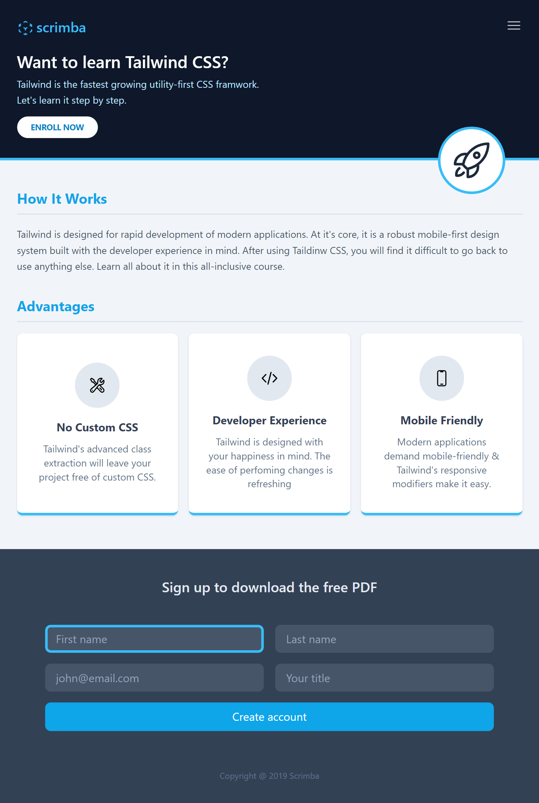
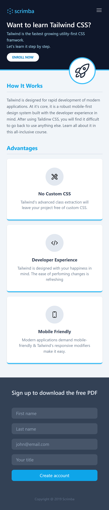

# Scrimba Tailwind CSS Course Final Project

This is a solution to the [Scrimba Tailwind CSS Course final assessment](https://scrimba.com/learn/tailwind/final-course-project-landing-page-cPJZqqC3). Goal of this project was to build a mobile-first webpage layout using Tailwind CSS and it's media classes. 

[Check it out live!](https://your-live-site-url.com)

## Table of contents

- [Scrimba Tailwind CSS Course Final Project](#scrimba-tailwind-css-course-final-project)
  - [Table of contents](#table-of-contents)
  - [Overview](#overview)
    - [Screenshot](#screenshot)
    - [Links](#links)
  - [My process](#my-process)
    - [Built with](#built-with)
    - [What I learned](#what-i-learned)
  - [Author](#author)
  - [Useful Links](#useful-links)

## Overview

This exercises focuses on practicing Tailwind CSS classes and features to create a responsive, mobile-first page design.

What to expect from this solution:

- Semantic page layout and similar design to assessment preview
- Text using Tailwind typography and margin/ padding classes
- Big icon using absolute and relative positioning
- Main content cards using Flex classes to accomodate 3 cards in a column-like fashion on mobile devices
- Main content cards change to Flex direction row and adjusted padding on bigger devices
- Responsive input form in a column-like fashion with full width on mobile devices
- Input form changes to Flex direction row with wrapping for a grid style layout on bigger devices
- Page content does not grow bigger past Tailwind's medium device size, while backgrounds do

### Screenshot

Tablet View

Mobile View

### Links

- [Vercel Live Site](https://your-live-site-url.com)

## My process

Starting this project, I have used Vite to create a simple hmtl + css + vanilla js template, adding the Tailwind CSS CDN. I didn't intend to use any custom properties, so using the CDN for production purposes was sufficient.

I separated the app page with a simple Header / Main / Footer layout in HTMl and added any text releated content. After that, I went on to adjust basic background colors, typography attributes such as font weight, text size and font colors.

In my experience, when an existing product design has to be replicated, it is a lot easier to figure out spacing and layout after paragraphs and headers have a similar typography and background colors to the design; all that is left to do after that is to "push around" the UI elements into their respective place, rather than having to readjust typography and margins / padding in respect to each other.

A small challenge was to place the rocketship icon on top of the header border. At first I intended to do this with a negative margin, but have opted for an absolute placement in relation to the header content container, as using the top/left/bottom/right properties to move the icon is more intuitive.

The advantages card items where done with flexbox in the colum direction with between justify, using a y directional gap instead of margin. When switching to the medium device size, I have added a x direction gap as well.

The form layout within the footer was a little more tricky, as I had to use flex grow and warp, which I have not had much experience with yet. Overall I'm more happy with my solution using only gap insteady of some of the Scrimba courses proposed solutions with div wrapping and margins. To make the form a little more responsive, I have added a blue border with a fade in transition and a green focus border. 

One last small challenge was to make the footer stretch, so there's no gap between the footer and the page body on very big screen sizes, while also maintaining the forms scale. Gaining more experience with flex, justify between and grow allowed me to find a solution quickly.

### Built with

- Semantic HTML5 markup
- [Tailwind CSS frontend framework](https://tailwindcss.com/)
- Flexbox
- Mobile-first workflow
- [Vite](https://vitejs.dev/)
- [Vercel for live view](https://vercel.com/)

### What I learned

- Using Tailwind classes for typography, layout, media queries, design and animation.
- Nesting multiple flexbox div's to form a more complex UI
- Using flex grow and justify between 
- Using absolute / relative positioning with Tailwind 
- General responsive web design
- Using Heroicons SVG Icons  

## Author

- GitHub - [Rauldotgit](https://github.com/rauldotgit)

## Useful Links

- [Great SVG Icons by the Tailwind makers](https://heroicons.com/)
- [Learn Tailwind CSS](https://scrimba.com/learn/tailwind)
